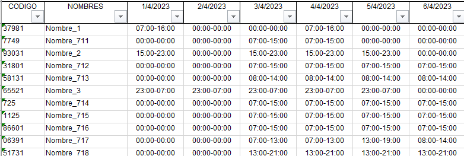
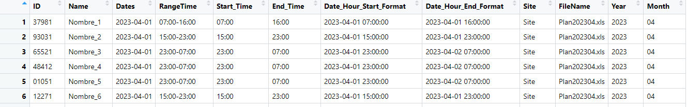

# Preparation of the data from Human Resources Planning to a productivity Analysis 

This is part of a project focusing on preparing and analyzing data from monthly human resource planning data to evaluate employee productivity or occupancy based on time dedicated to daily tasks.

The original dataset is structured in a table where each row corresponds to a person, identified by a code and a "Name", and each columns represent the days of the month with entry and exit times, as shown in the next image:

In the R file, I made the Data Preparation Process.

The data preparation process transforms this structure into a format suitable for analysis. The transformation converts the wide format (one column for each day) into a long format, where each record (row) represents a workday and its corresponding work hours for each employee. This allows for calculating daily assigned time per worker and analyzing occupation patterns based on time worked.

Preparation Steps:

**1.- Loading the monthly files:** The monthly planning files are read from a folder, containing employee names, codes, dates in columns and entry/exit times.
**2.- Data transformation:** R is used to transform entry and exit times into worked hours. The data is reshaped from wide format (one column per day) to long format (one row per day and employee).
**3.- CSV Output:** The prepared dataset can be sent to a database or into a .csv file to be used later.

The output file is shown here:

